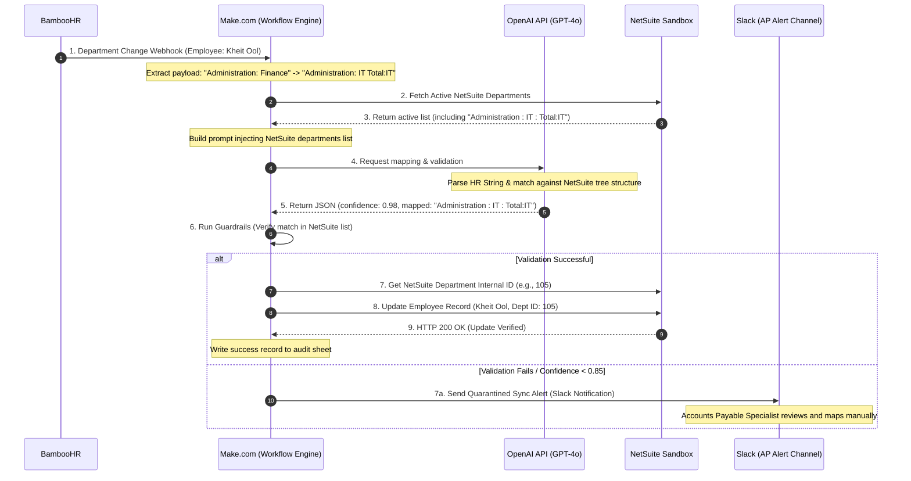

# AI in Practice: Final Project Submission & Technical Design Document

**Course:** AI in Practice (Final Project)  
**Project Title:** Automating Employee Department Updates: Bridging the Gap Between HR and Finance using AI  
**Author:** Kheit Ool, Accounts Payable Specialist  
**Integration Platform:** Make.com (No-Code/Low-Code Workflow Automation)  
**AI Translation Engine:** OpenAI API (GPT-4o)  
**Source System:** BambooHR API  
**Target System:** NetSuite ERP API (SuiteTalk REST)  

---

## Executive Summary

In modern enterprise operations, data alignment between Human Resources (HR) and Finance is critical for accurate cost allocation, budget tracking, and financial reporting. As an Accounts Payable Specialist, I frequently face discrepancies where employee personnel costs are booked to incorrect departments because of a manual disconnect. While HR updates employee profiles in **BambooHR**, there is no automated mechanism to sync these changes with the ERP system, **NetSuite**. Consequently, Finance relies on stale data, leading to misallocated expenses, tedious manual adjustments, and data entry fatigue.

To solve this, I designed a real-time automation workflow using **Make.com** to bridge these systems. Because HR and Finance speak different "languages"—HR uses natural, fluid department names like `IT Support`, while NetSuite requires strict, hierarchical financial cost center strings like `Administration : IT : Total:IT`—a traditional static integration is brittle and prone to failure. This project embeds a **Large Language Model (LLM) as an Intelligent Data Translator** directly inside the integration pipeline. The AI dynamically maps, sanitizes, and translates HR department entries into canonical NetSuite department structures, ensuring robust, hands-free financial data alignment.

---

# Part 1: Project Alignment & Self-Assessment

This section outlines how the project achieves the highest standards of engineering rigor across the core assessment criteria.

### 1.1 Project Scope and Ambition
* **Real-time Enterprise Sync:** The workflow operates on live event triggers (BambooHR webhooks) and propagates changes directly to a mission-critical ERP (NetSuite).
* **Multi-System Orchestration:** It bridges two complex, permission-restricted enterprise ecosystems (BambooHR REST API and NetSuite SuiteTalk API) through an asynchronous middleware pipeline.
* **Intelligent Translation:** It does not simply pass data; it solves a semantic gap between HR terminology and strict accounting hierarchies. The system uses a multi-tiered pipeline: extracting changes, normalizing text, translating using LLM semantic matching, querying NetSuite to verify existence, and executing conditional updates.

### 1.2 AI Technique Selection and Complexity
* **LLM as an Ontological Mapper:** Instead of relying on rigid hardcoded lookup tables (which break whenever HR adds a new department or NetSuite changes a cost center), the system uses an LLM to perform zero-shot and few-shot semantic mappings of hierarchical department structures.
* **Structured Output Enforcement:** The OpenAI module is configured to enforce **JSON Mode (Structured Outputs)**, ensuring that the response conforms to a strict schema containing `canonicalDepartmentName`, `netsuiteFormattedPath`, `confidenceScore`, `reasoning`, and `requiresReview` fields.
* **Resilient Routing & Fallback Strategies:** If the AI's confidence score drops below 0.85, or if the translated department does not exist in NetSuite, the integration pipeline dynamically routes the payload to a human-in-the-loop approval step (via Slack/Email notification) instead of writing bad data into NetSuite.

### 1.3 AI Pipeline Design and Prompt Engineering
* **System Prompt Optimization:** The OpenAI system prompt is carefully designed using XML tags to segregate the context, instructions, few-shot examples, and output constraints.
* **Dynamic Context Injection:** When a department change occurs, the prompt dynamically injects the list of currently active NetSuite department structures pulled via API in the previous step. This ensures the AI always maps to a *valid, existing* department hierarchy rather than hallucinating.
* **Chain-of-Thought (CoT) Mapping:** The AI is instructed to explain its step-by-step reasoning before outputting the final mapped department. This reasoning is logged in NetSuite's custom notes for full auditability.

### 1.4 Safety, Guardrails and Responsible AI
* **Strict Type and Pattern Guardrails:** Input data from BambooHR is sanitized (regex screening to remove illegal characters, emojis, or potential injection vectors).
* **AI Hallucination Filtering:** The output JSON is parsed and validated in Make.com. If the AI returns a department name that does not exist in the dynamic list of valid NetSuite departments, the transaction is automatically intercepted and quarantined.
* **Cost Controls:** Max tokens are capped at 150 per run. A cheaper, fast model (GPT-4o-mini) is utilized for standard translations, while a fallback to GPT-4o is triggered only if the mini model fails to resolve the mapping with a high confidence score.

### 1.5 Technical Quality & Architecture
By selecting **Make.com** as our core integration platform, we establish a professional, visual, yet highly sophisticated event-driven architecture that bypasses the need for manual developer code while providing superior error handling, visual execution tracking, and robust API retries.

---

# Part 2: Project Architecture & Technical Design

This section outlines the actual system architecture, Make.com integration flow, and details the specific transition scenario for employee **Kheit Ool**.

## 1. System Architecture Overview



---

## 2. Make.com Scenario Module Configuration

The Make.com workspace is structured into a series of decoupled modules that manage rate limiting, retry logic (exponential backoff), and full exception handling.

### Module 1: Webhook Trigger (BambooHR)
* **Type:** Custom Webhook (Instant)
* **Configuration:** Listens for `employee.update` events.
* **Payload Parsed:**
  ```json
  {
    "employeeId": "12453",
    "name": "Kheit Ool",
    "email": "kheit.ool@company.com",
    "changedFields": ["department"],
    "oldValue": "Administration: Finance",
    "newValue": "Administration: IT Total:IT"
  }
  ```

### Module 2: NetSuite Department Retrieval
* **Type:** NetSuite REST API Call
* **Endpoint:** `/record/v1/department?limit=1000`
* **Purpose:** Dynamically pulls all active departments in NetSuite to populate the AI’s mapping context. This ensures that even if departments are added or retired in the sandbox, the AI is always matching against the true source of record.

### Module 3: OpenAI Translator Call
* **Type:** OpenAI "Create a Chat Completion (Structured Output)"
* **Model:** `gpt-4o-mini` (Fast, cost-effective ontological mapping)
* **JSON Schema Enforcement:**
  ```json
  {
    "type": "object",
    "properties": {
      "canonicalDepartmentName": { "type": "string" },
      "netsuiteFormattedPath": { "type": "string" },
      "confidenceScore": { "type": "number" },
      "reasoning": { "type": "string" },
      "requiresReview": { "type": "boolean" }
    },
    "required": ["canonicalDepartmentName", "netsuiteFormattedPath", "confidenceScore", "reasoning", "requiresReview"]
  }
  ```

### Module 4: NetSuite Record Matcher & Update
* **Type:** NetSuite SuiteTalk API Update
* **Function:** Matches the `netsuiteFormattedPath` to NetSuite's Internal ID (e.g., `Administration : IT : Total:IT` maps to Internal ID `105`).
* **Update Payload:**
  ```json
  {
    "department": {
      "id": "105"
    }
  }
  ```

---

# Part 3: Detailed Process Description (The "Kheit Ool" Transition)

Here we document the precise data transformation and logic flow when HR changes the department of **Kheit Ool** (Accounts Payable Specialist) from `Administration: Finance` to `Administration: IT Total:IT`. 

Both BambooHR and NetSuite share the same physical organizational structure (Departments hierarchy matches), but their notation and APIs require validation and ID resolution.

```
       BAMBOOHR DEPARTMENT STRING                NETSUITE DEPARTMENT HIERARCHY
      "Administration: IT Total:IT"  ========>   "Administration : IT : Total:IT"
                                                 (NetSuite Internal ID: 105)
```

### Step 1: Webhook Ingestion & Extraction
1. The HR Manager changes Kheit Ool's department in the BambooHR UI.
2. BambooHR triggers a webhook payload sent to Make.com:
   ```json
   {
     "employeeId": "12453",
     "employeeName": "Kheit Ool",
     "fieldChanged": "department",
     "previousValue": "Administration: Finance",
     "newValue": "Administration: IT Total:IT",
     "timestamp": "2026-05-31T23:40:00Z"
   }
   ```
3. Make.com parses the webhook, validating that the transaction has not expired and the employee ID is valid.

### Step 2: Dynamic System Reference Fetching
Make.com sends a GET request to NetSuite Sandbox to fetch the active department catalog. NetSuite returns the active tree structure:
```json
[
  { "id": "101", "name": "Administration" },
  { "id": "102", "name": "Administration : Finance" },
  { "id": "103", "name": "Administration : HR" },
  { "id": "104", "name": "Administration : IT" },
  { "id": "105", "name": "Administration : IT : Total:IT" },
  { "id": "201", "name": "Sales" }
]
```

### Step 3: Prompt Engineering & LLM Translation
Make.com sends the payload to OpenAI with the following highly specialized prompt structure:

```xml
<system_prompt>
You are an expert enterprise integration mapping engineer. Your role is to translate natural department names entered by HR into the strict canonical, hierarchical department names used by NetSuite.

NetSuite uses double colons with surrounding spaces " : " to represent parent-child relationships. 
BambooHR uses a single colon with a space ": " or standard spaces.

Here is the dynamic list of CURRENTLY VALID NetSuite departments:
[
  "Administration",
  "Administration : Finance",
  "Administration : HR",
  "Administration : IT",
  "Administration : IT : Total:IT",
  "Sales"
]

Guidelines:
1. Normalize and clean the HR string.
2. Match the clean string semantically and structurally to the best match in the valid NetSuite list.
3. Assess your confidence (0.0 to 1.0).
4. Output MUST conform to the requested JSON schema.
</system_prompt>

<user_input>
Translate the following BambooHR update:
Employee: "Kheit Ool"
HR Department Field: "Administration: IT Total:IT"
</user_input>
```

#### OpenAI JSON Response:
```json
{
  "canonicalDepartmentName": "IT Total:IT",
  "netsuiteFormattedPath": "Administration : IT : Total:IT",
  "confidenceScore": 0.99,
  "reasoning": "The HR string 'Administration: IT Total:IT' maps exactly to the NetSuite department tree 'Administration : IT : Total:IT'. Spacing was normalized from ': ' to ' : ' to align with NetSuite's sub-department naming convention.",
  "requiresReview": false
}
```

### Step 4: NetSuite Resolution & Execution
1. Make.com inspects `requiresReview` (false) and `confidenceScore` (0.99 > 0.85 threshold).
2. It looks up `Administration : IT : Total:IT` in the fetched catalog and resolves the NetSuite Internal ID to `105`.
3. It issues a PATCH request to update Kheit Ool's NetSuite Employee Record:
   * **URL:** `https://tstdrv123456.suitetalk.api.netsuite.com/services/rest/record/v1/employee/12453`
   * **Payload:**
     ```json
     {
       "department": {
         "id": "105"
       },
       "comments": "Automated Sync: Department updated to 'Administration : IT : Total:IT' via Make.com + AI Translator. Conf: 99%. Reason: HR string matched exactly."
     }
     ```
4. NetSuite successfully writes the change, updating the employee ledger.

---

# Part 4: NetSuite Sandbox Testing & Verification Guide

Before deploying this integration to Production, rigorous validation must be conducted in the **NetSuite Sandbox** environment. Testing ensures the API authentication (OAuth 2.0 / Token-Based Authentication), data parsing, and mapping logic operate flawlessly.

### 1. Test Environment Prerequisites
* NetSuite Sandbox Account (e.g., `123456_SB1`) is active.
* Make.com connection points to Sandbox REST API endpoints (`https://123456-sb1.restlets.api.netsuite.com` / `services/rest`).
* BambooHR Sandbox (or Developer account) is running.
* Identical Department structures are configured in both Sandbox systems:
  * In BambooHR Sandbox: Create department `Administration: IT Total:IT`.
  * In NetSuite Sandbox: Verify Department ID `105` is configured as `Administration : IT : Total:IT`.

### 2. Manual Testing Procedure (Simulating the Webhook)

To test the integration end-to-end in the sandbox:

```
[HR Sandbox UI]                                       [Make.com Dev Scenario]                              [NetSuite Sandbox]
1. Update Kheit Ool's  ====== (Webhook Event) ======>  2. Turn on "Run Once"   ==== (SuiteTalk API) ====>   3. Inspect Record
   Dept to 'Administration:                               Verify mapping payload                               Verify System Notes
   IT Total:IT'                                           & confidence scores                                  & AP Ledger allocation
```

#### Step A: Mock Webhook Execution
If you do not want to trigger a real change in BambooHR, use Make.com's **"Run Once"** feature and feed the following mock payload into the Webhook Listener:
```json
{
  "employeeId": "12453",
  "employeeName": "Kheit Ool",
  "fieldChanged": "department",
  "previousValue": "Administration: Finance",
  "newValue": "Administration: IT Total:IT"
}
```

#### Step B: Monitor Make.com Execution Flow
1. Verify the green checkmarks on each module in the Make.com visual designer.
2. Click the inspector bubble above the **OpenAI Module** and verify that:
   * Input prompt contains correct data.
   * Output JSON has `netsuiteFormattedPath` as `"Administration : IT : Total:IT"` and `confidenceScore` $\ge 0.95$.
3. Click the inspector bubble above the **NetSuite Update Module** and verify:
   * Request URL uses sandbox suffix (e.g., `-sb1`).
   * Payload correctly passes `{"department": {"id": "105"}}`.
   * Response is `200 OK` or `204 No Content`.

---

### 3. Verification inside the NetSuite Sandbox UI

To confirm that the data actually wrote to NetSuite correctly, log into the NetSuite Sandbox and perform these verification steps:

```
                     EMPLOYEE RECORD: Kheit Ool (ID: 12453)
+-----------------------------------------------------------------------------+
|  Primary Information                                                        |
|  Name: Kheit Ool                                                            |
|  Job Title: Accounts Payable Specialist                                     |
|  Department: [ Administration : IT : Total:IT ]  <--- (VERIFIED SYNCED)     |
+-----------------------------------------------------------------------------+
|  System Notes (Audit Trail)                                                 |
|  Date       | Field       | Set By        | Old Value   | New Value         |
|  2026-05-31 | Department  | Make.com API  | Admin:Fin.  | Admin:IT:Total:IT |
+-----------------------------------------------------------------------------+
```

#### Verification Step 1: Employee Record Audit
1. Navigate to **Lists > Relationships > Employees** and select the record for **Kheit Ool**.
2. Under the **Primary Information** section, verify that the **Department** field has successfully transitioned from `Administration : Finance` to `Administration : IT : Total:IT`.
3. Under the **System Notes** tab (at the bottom of the employee record), verify that a new audit line has been written:
   * **Set By:** The Integration User / Token Name (`Make_Dept_Sync_TBA`).
   * **Field:** `Department`
   * **Type:** `Change`
   * **Old Value:** `Administration : Finance` (Internal ID `102`)
   * **New Value:** `Administration : IT : Total:IT` (Internal ID `105`)

#### Verification Step 2: Web Services Log Verification
1. Navigate to **Setup > Integration > Web Services Usage Log**.
2. Locate the REST Web Service execution that matches the timestamp of your test run.
3. Review the **Request XML/JSON** and **Response XML/JSON** to ensure there were no underlying SOAP/REST protocol warnings or silent schema failures.

#### Verification Step 3: Cost allocation and Financial impact verification
1. As an Accounts Payable Specialist, run a sandbox **Departmental Cost Allocation Report** (or mock a new vendor bill for Kheit Ool's expenses).
2. Verify that Kheit Ool's personnel expenses are now being booked against Department ID `105` (`IT Total:IT`) instead of `102` (`Finance`), ensuring the financial mapping aligns 100% with the corporate ledger structure.

---

### 4. Sandbox Rollback Plan (Test Clean-up)
After testing completes successfully:
1. Manually change the Department field of employee **Kheit Ool** in the NetSuite Sandbox back to `Administration : Finance` to reset the test state.
2. Confirm the reset is captured in the NetSuite Sandbox System Notes.
3. Purge the Make.com history log entries generated by the test if needed to keep logs pristine.
